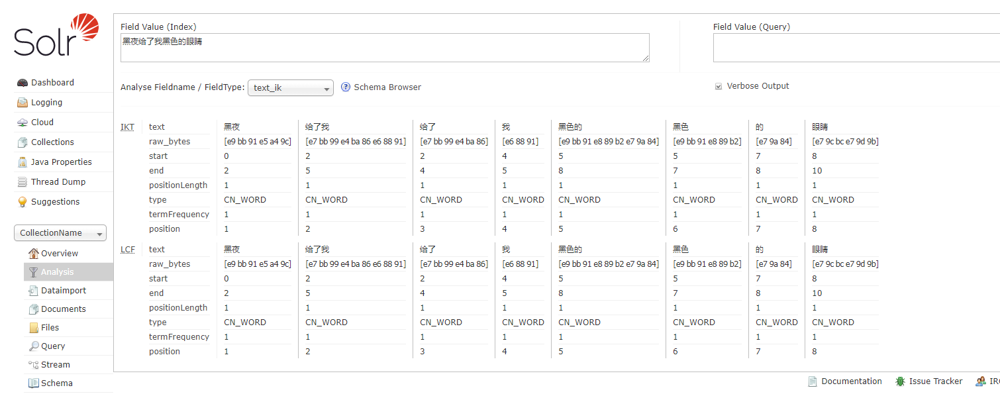

# 中文分词 ikanalyzer

## 下载地址

- https://search.maven.org/search?q=com.github.magese

## 修改配置

- 下载对应 Solr 集合的 managed-schema, 并添加如下

```
<!-- ik分词器 -->
<fieldType name="text_ik" class="solr.TextField">
  <analyzer type="index">
      <tokenizer class="org.wltea.analyzer.lucene.IKTokenizerFactory" useSmart="false" conf="ik.conf"/>
      <filter class="solr.LowerCaseFilterFactory"/>
  </analyzer>
  <analyzer type="query">
      <tokenizer class="org.wltea.analyzer.lucene.IKTokenizerFactory" useSmart="true" conf="ik.conf"/>
      <filter class="solr.LowerCaseFilterFactory"/>
  </analyzer>
</fieldType>
```

## 测试

- 选择核心，没有的话创建
- Analysis
- 
