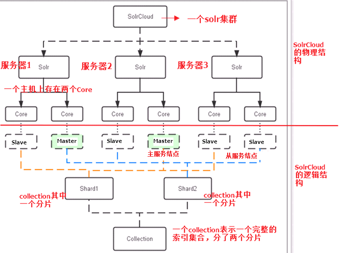
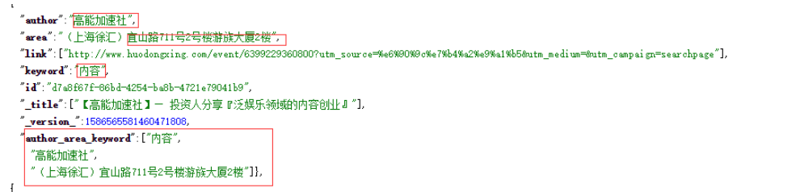

# SolrCloud

## 1. 什么是 SolrCloud

- SolrCloud 是 Solr 提供的分布式搜索方案，当你需要大规模，容错，索引量很大，搜索请求并发很高时可以使用 SolrCloud
- 它是基于 Solr 和 Zookeeper 的分布式搜索方案，它的主要思想是使用 Zookeeper 作为集群的配置信息中心

## 2. 特色

- 集中式的配置信息
- 自动容错
- 近实时搜索
- 查询时自动负载均衡

## 3. 结构图



### 物理结构

- 3 个 Solr 实例（ 每个实例包括两个 Core），组成一个 SolrCloud
- 每个 Solr 包含 2 个 Core

### 逻辑结构

#### collection

- Collection 在 SolrCloud 集群中是一个逻辑意义上的完整的索引结构
- 常常被划分为一个或多个 Shard（分片），它们使用相同的配置信息

#### Shard

- Collection 的逻辑分片
- 每个 Shard 被化成一个或者多个 replication，通过选举确定哪个是 Leader

#### Core

- 每个 Core 是 Solr 中一个独立运行单位，提供索引和搜索服务。
- 一个 shard 需要由一个 Core 或多个 Core 组成。

#### Master & Slave

- Master 是 master-slave 结构中的主结点，Slave 是 master-slave 结构中的从结点
- 同一个 Shard 下 master 和 slave 存储的数据是一致的，这是为了达到高可用目的

## 4. 字段类型

### 普通(固定)字段

```
<field name="price" type="float" default="0.0" indexed="true" stored="true"/>
```

### 复制字段

- 将字段联合起来，然后进行搜索

```
<field name="author_area_keyword" type="string" multiValued="true" indexed="true" stored="false"/>
<copyField source="area" dest="author_area_keyword"/>
<copyField source="author" dest="author_area_keyword"/>
<copyField source="keyword" dest="author_area_keyword"/>
```



### 动态字段

- 正常情况下，需要事先把知道的字段定义在 mnaged_schema 中
- 在索引文档时，一个字段如果在常规字段中没有匹配时，将到动态字段中匹配
- 若定义了一个叫\*\_s 的动态动态字段，如果要索引一个叫 name_s 的字段，但是 schema 中不存在 name_s 的字段，这样 name_s 将被索引到\*\_s 字段中

```
<dynamicField name="*_s" type="string" indexed="true" stored="true"/>
```

## 5. 参考

- https://www.w3cschool.cn/solr_doc/solr_doc-jmqv2fzk.html
- https://lucene.apache.org/solr/guide/8_2/solr-tutorial.html
